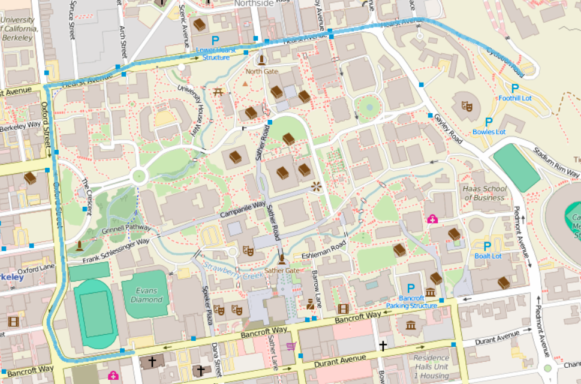

# Introduction

This this a project from Berkeley's course CS61b 19 spring

# Online Applicartion

The online location of the application is : http://bearmaps-zetong.herokuapp.com/. However the application could be slow since I am using a free version of Heroku.

# Usage

- You can zoom in and out the map using the mouse wheel or buttons on the search bar.

- Double click to set the begin point and the double click again to set the end point.

  

- After the route has been set, click the billboard symbol to see the detailed turn by turn navigation.

  

- Click the `CLEAR ROUTE` button to clear the route.

- Search a certain location on the search bar. The realted information will be given automatically.

  

  The queried palce will be shown with a red dot.

  

# Deployment

#### Importing the BeaMaps Folder

Start by opening the project as usual (using “Open or Import” in IntelliJ’s welcome window).

Next, we’ll need to import the special proj2d libraries that are in the `javalib/proj2d` folder.

To do this, click “File” → “Project Structure”, then click “Libraries” on the screen that pops up. You should see something like what is shown in the figure below. The next step is to click the plus sign at the top of the screen, then click “Java” from the list of options.

Navigate to the library-fa19 folder and click on the proj2d folder. Click OK to import th libraries and also import other libraries with the `library-sp19` folder.

#### Marking the static Directory

Make sure your “static” folder is marked as the “Sources Root”. The folder should be highlighted in blue if it is already marked as the “Sources Root”.

If this is not the case for you, go to “Project Structure” → “Modules” →. Right click on the “static” folder and choose “Sources” → “OK”. The “static” folder should now be highlighted in blue.

## RUN

- Run the class `MapServer`, you should see something similar to:

  ~~~
  [Thread-0] INFO org.eclipse.jetty.util.log - Logging initialized @1869ms to org.eclipse.jetty.util.log.Slf4jLog
  [Thread-0] WARN org.eclipse.jetty.server.AbstractConnector - Ignoring deprecated socket close linger time
  [Thread-0] INFO spark.webserver.JettySparkServer - == Spark has ignited ...
  [Thread-0] INFO spark.webserver.JettySparkServer - >> Listening on 0.0.0.0:4567
  [Thread-0] INFO org.eclipse.jetty.server.Server - jetty-9.4.15.v20190215; built: 2019-02-15T16:53:49.381Z; git: eb70b240169fcf1abbd86af36482d1c49826fa0b; jvm 11.0.2+9-LTS
  [Thread-0] INFO org.eclipse.jetty.server.session - DefaultSessionIdManager workerName=node0
  [Thread-0] INFO org.eclipse.jetty.server.session - No SessionScavenger set, using defaults
  [Thread-0] INFO org.eclipse.jetty.server.session - node0 Scavenging every 660000ms
  [Thread-0] INFO org.eclipse.jetty.server.AbstractConnector - Started ServerConnector@3405d917{HTTP/1.1,[http/1.1]}{0.0.0.0:4567}
  [Thread-0] INFO org.eclipse.jetty.server.Server - Started @2235ms
  ~~~

-  Look for `static.page` towards the bottom of the project directory. Expand it, and you should see `map.html`. Right click on this file, then go to “Open in Browser”, to open the application on the browser.